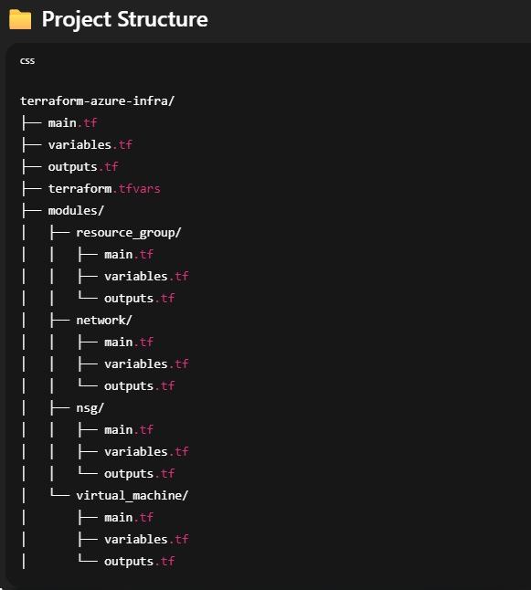

# 🌐 Azure Terraform Infrastructure (Modular)

> Built by [@surajkk93](https://github.com/surajkk93) to demonstrate clean Infrastructure as Code (IaC) practices.

---

## 🚀 What’s Included?

This project provisions:

- ✅ Azure Resource Group
- ✅ Virtual Network and Subnet
- ✅ Network Security Group (NSG) with HTTP/HTTPS rules
- ✅ Ubuntu Virtual Machine with SSH access
- ✅ Modular structure for clean, reusable code

---

## 🧱 Project Structure


---

## 📦 Prerequisites

- Terraform v1.5+
- Azure CLI (`az login`)
- SSH installed (`ssh-keygen`)

---

## 🔐 SSH Key Setup (Required)

Terraform **does not create `.pem` files** automatically like the Azure Portal.

### Step 1: Generate SSH key pair

```bash
ssh-keygen -t rsa -b 4096 -f ~/.ssh/azure_vm_key
```

### Step 2: Add your public key to `terraform.tfvars`

```hcl
ssh_public_key = "ssh-rsa AAAAB3NzaC1yc2EAAAADAQABAAACAQ..."
```

> ⚠️ Do **NOT** commit your private key!

---

## ⚙️ Usage Instructions

### Step 1: Clone the Repo

```bash
git clone https://github.com/surajkk93/azure-terraform-infra-modules.git
cd azure-terraform-infra-modules
```

### Step 2: Update `terraform.tfvars`

```hcl
location       = "East US"
vnet_name      = "portfolio-vnet"
subnet_name    = "default-subnet"
ssh_public_key = "ssh-rsa AAAAB3NzaC1yc2EAAAADAQABAAACAQ..."
```

### Step 3: Deploy

```bash
terraform init
terraform plan
terraform apply
```

---

## 🖥️ Connect to Your VM

```bash
ssh -i ~/.ssh/azure_vm_key azureuser@<public-ip>
```

Get the public IP from Terraform output.

---

## 🚫 .gitignore

Make sure this is in your `.gitignore`:

```
*.key
*.pem
terraform.tfvars
```

---

## 💡 Why This Project?

- 🚀 Clean modular structure
- 🛡️ Secure SSH-based VM access
- 🔁 Reusable components
- 📁 Real-world production layout

---

## 📌 Possible Extensions

- Add Azure Key Vault + Managed Identity
- Add Load Balancer and Auto-scaling
- Implement multi-env (dev/stage/prod) via workspaces or folders
- CI/CD with GitHub Actions + `terraform fmt`, `validate`, and `plan`

---

## 🙌 Author

Made with ❤️ by [**Suraj Kulkarni**](https://github.com/surajkk93)
